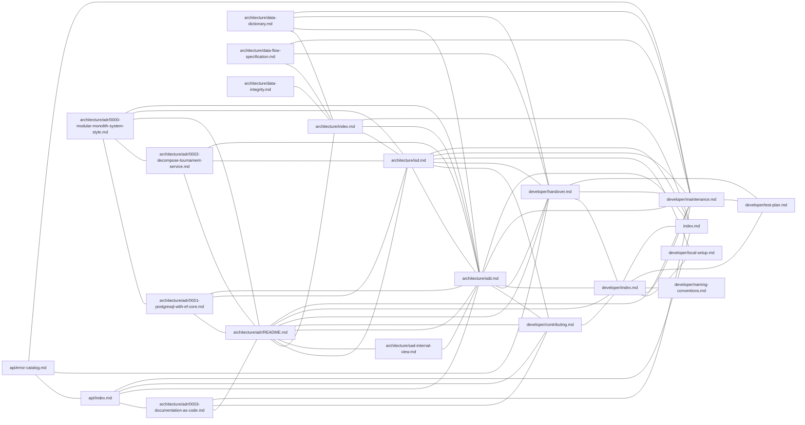

```mermaid
graph LR
  n0["api/error-catalog.md"]
  n1["api/index.md"]
  n2["architecture/adr/0000-modular-monolith-system-style.md"]
  n3["architecture/adr/0001-postgresql-with-ef-core.md"]
  n4["architecture/adr/0002-decompose-tournament-service.md"]
  n5["architecture/adr/0003-documentation-as-code.md"]
  n6["architecture/adr/README.md"]
  n7["architecture/data-dictionary.md"]
  n8["architecture/data-flow-specification.md"]
  n9["architecture/data-integrity.md"]
  n10["architecture/index.md"]
  n11["architecture/isd.md"]
  n12["architecture/sad-internal-view.md"]
  n13["architecture/sdd.md"]
  n14["developer/contributing.md"]
  n15["developer/handover.md"]
  n16["developer/index.md"]
  n17["developer/local-setup.md"]
  n18["developer/maintenance.md"]
  n19["developer/naming-conventions.md"]
  n20["developer/test-plan.md"]
  n21["index.md"]
  n0 --- n1
  n0 --- n15
  n0 --- n18
  n1 --- n5
  n1 --- n13
  n1 --- n14
  n1 --- n21
  n2 --- n3
  n2 --- n4
  n2 --- n6
  n2 --- n11
  n2 --- n13
  n3 --- n6
  n3 --- n11
  n3 --- n13
  n4 --- n6
  n4 --- n11
  n4 --- n13
  n5 --- n6
  n5 --- n14
  n5 --- n18
  n6 --- n10
  n6 --- n11
  n6 --- n12
  n6 --- n13
  n6 --- n14
  n6 --- n15
  n6 --- n16
  n6 --- n18
  n7 --- n10
  n7 --- n13
  n7 --- n15
  n7 --- n18
  n8 --- n10
  n8 --- n15
  n8 --- n18
  n9 --- n10
  n10 --- n11
  n10 --- n13
  n10 --- n21
  n11 --- n13
  n11 --- n14
  n11 --- n15
  n11 --- n17
  n11 --- n18
  n11 --- n21
  n12 --- n13
  n13 --- n14
  n13 --- n15
  n13 --- n16
  n13 --- n18
  n13 --- n21
  n14 --- n16
  n15 --- n16
  n15 --- n18
  n15 --- n20
  n16 --- n17
  n16 --- n18
  n16 --- n19
  n16 --- n20
  n16 --- n21
  n18 --- n20
```
